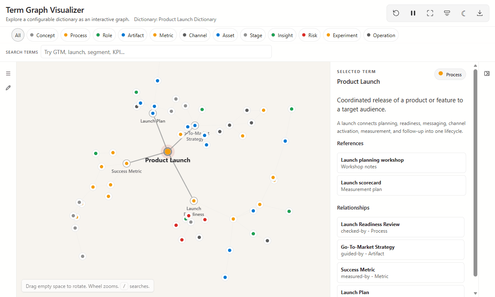

# Term Graph Visualizer

> **Turn a glossary into an explorable term graph.** Define terms once, connect them with typed relationships, cite the sources behind each definition, and share the result as a static HTML experience.

[](https://vite.dev)
[](https://developer.mozilla.org/docs/Web/JavaScript)
[](schema/dictionary.schema.json)
[](LICENSE)

Many glossaries are easiest to start as a list, but harder to explore once terms begin depending on each other. Term Graph Visualizer keeps the list and adds a connected view: how concepts relate, which sources support them, which acronyms map to which terms, and what cluster a term belongs to. Use it for project dictionaries, capability maps, architecture vocabularies, onboarding guides, and shareable term maps. 🕸️

### How to use it

1. Generate or write a dictionary JSON file for your project vocabulary.
2. Open it in the local app to explore, edit, and validate the term graph.
3. Download a static HTML snapshot to share with your project team.

## See it in action

The sample dictionary is synthetic: a fictional product launch vocabulary that demonstrates clusters, aliases, sources, and typed edges.



## Contents

- [What it does](#what-it-does)
- [How it works](#how-it-works)
- [Quick start](#quick-start)
- [Repository layout](#repository-layout)
- [Sample data, privacy, and inspiration](#sample-data-privacy-and-inspiration)

## What it does

| Capability | Why it matters |
| --- | --- |
| 🕸️ **Interactive graph** | See terms as connected concepts instead of isolated definitions. |
| 🧭 **Category chips** | Filter the graph from the horizontal legend. |
| 🔎 **Acronym search** | Find terms by aliases like `GTM`, `KPI`, or any synonym you define. |
| 🔗 **Typed relationships** | Model edges such as `owns`, `uses`, `precedes`, `returns`, or `measured-by`. |
| ⚖️ **Meaningful sizing** | Larger nodes have more graph connections, while depth stays subtle. |
| 📚 **Source references** | Track which documents, meetings, notes, or links support each term. |
| ✏️ **Local authoring mode** | Edit terms and references in the UI, then save back to JSON. |
| 📦 **Static export** | Produce a self-contained, view-only HTML file for sharing. |

## How it works

Each dictionary is a JSON config. The app renders that data as an interactive graph, supports local editing during authoring, validates against the schema, and exports a self-contained static HTML file for sharing. Nodes use deterministic placement with a small 3D force simulation, so the same dictionary opens in a stable, organic layout. See [Dictionary format](docs/dictionary-format.md) and the [JSON Schema](schema/dictionary.schema.json) for the full contract.

## Quick start

### Run the app

```powershell
npm install
npm run dev
```

The app starts with the dictionary configured by `VITE_DEFAULT_CONFIG`. The public sample is:

```env
VITE_DEFAULT_CONFIG=/configs/example-dictionary.json
```

Open the local app, use the category chips and search bar to explore the graph, then select a term to inspect its definition, references, and relationships.

### Create your own local dictionary

Use the setup helper to copy the public example into a private, ignored local config:

```powershell
npm run init:local -- my-dictionary-name
npm run dev
```

This creates:

```text
public/configs/local-my-dictionary-name.json
.env
```

Files matching `public/configs/local-*.json` are ignored by git, which helps keep private or project-specific dictionaries out of commits.

### Generate a dictionary with AI

You can ask an AI assistant to draft one from source material. Good extraction targets include:

| Source | Useful for extracting |
| --- | --- |
| Slide decks | terms, systems, roles, workflows, and architecture components |
| Meeting transcripts | acronyms, decision language, open questions, and working definitions |
| Planning docs | phases, milestones, owners, dependencies, and risks |
| Architecture notes | components, integrations, data flows, and typed relationships |


✨ Copilot/Cowork-style prompt:

```text
Look through my meetings, chats, shared files, slide decks, notes, and transcripts from the last 90 days about [project/domain]. Prioritize recent content, but include older material if it defines important architecture, governance, process, or business terminology.

Create a Term Graph Visualizer dictionary from what you find. Treat this as a clustered concept map, not a flat glossary. Aim for the most useful 30-80 terms.

Return valid JSON only. Follow this repository's dictionary schema.

Include:
- categories for the main kinds of terms
- sources for every meeting, file, note, deck, or link used
- terms with id, title, category, summary, details, aliases, related, and sourceIds
- typed edges with source, label, and target

Guidelines:
- Use concise original wording. Do not quote long passages from private source material.
- Prefer stable, lowercase slug IDs.
- Make acronym aliases explicit.
- Attach at least one sourceId to every term.
- Use typed edges for meaningful relationships. Prefer labels like owns, produces, consumes, depends-on, governs, implements, tracks, measures, integrates-with, contains, supports, triggers, transitions-to, inputs, and outputs.
- Build clusters around lifecycle stages, systems, roles, artifacts, governance concepts, metrics, and integration points.
- Do not connect every term to one project hub. Connect the hub only to first-level concepts, then let detailed terms connect through their clusters.
- Avoid duplicate terms. Merge synonyms into aliases.
- Before returning the JSON, check for duplicate IDs, dangling related IDs, dangling edge endpoints, and sourceIds that do not exist in sources.

Prioritization:
- Prefer terms supported by multiple sources.
- Prefer concepts that explain how the domain operates.
- Prioritize architecture, workflows, systems, integrations, governance, metrics, ownership, and lifecycle concepts over meeting-specific discussion topics.
- Use meaningful categories. Avoid misc, other, or general.

If a required property is not supported by the evidence, use an empty value rather than inventing content. If evidence is weak for a term, omit it.

If the available information exceeds the target size, return only the highest-value first-pass JSON.
```

### Validate and build

```powershell
npm run validate:config -- /configs/example-dictionary.json
npm run build
```

### Authoring workflow

1. Use the list icon in the left rail to browse the filtered term list.
2. Use the pencil icon to edit the selected term.
3. Add aliases for acronyms and alternate names.
4. Select existing references, or add a new reference with a title, type, URL, and notes.
5. Click **Save JSON** to persist local edits.
6. Click the download icon to save a static HTML snapshot.

### Share with your project team

When the dictionary is ready, click the download icon to export a self-contained static HTML file. The exported file is view-only and includes the graph, search, filters, term details, references, and relationships, so teammates can open it directly without running the local app or installing dependencies.

## Repository layout

```text
src/                     application code
public/configs/          public sample dictionaries
schema/                  JSON Schema for dictionary files
docs/                    authoring documentation
scripts/                 local setup and validation utilities
```

## Sample data, privacy, and inspiration

The app is designed so the reusable viewer and the dictionary content stay separate. The included `example-dictionary.json` is synthetic sample data for demos, testing, and new-dictionary setup. Private or project-specific dictionaries should use the ignored `public/configs/local-*.json` naming pattern so local vocabulary, references, and project context do not get committed by accident.

This project was built with assistance from AI coding and design agents, with human direction and review throughout. Its concept was informed by public glossary and interactive dictionary experiences, including [AI Coding Dictionary](https://github.com/mattpocock/dictionary-of-ai-coding), while the app code, schema, editor, and export flow were implemented separately for this project.

## Contributing

Issues and pull requests are welcome. See [CONTRIBUTING.md](CONTRIBUTING.md) for setup, validation, and submission guidance.

## License

This project is available under the [MIT License](LICENSE).
